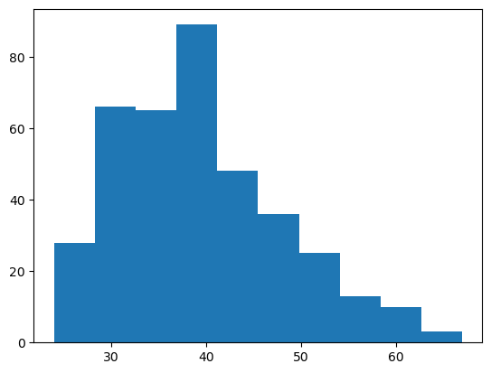

# Hypothesis Test - Lab

## Introduction

In this lab, you'll have the opportunity to decide to pick the variables that you want to perform one and two sample t-tests.

## Objectives

You will be able to:

* Construct and interpret a confidence interval for a single mean
* Perform a hypothesis test for a single mean
* Construct and interpret a confidence interval for two independent means
* Perform a hypothesis test for two independent means


## The Data: Last Words of Death Row Inmates

On Kaggle thre is a famous data set of *[Last Words of Death Row Inmates](https://www.kaggle.com/datasets/mykhe1097/last-words-of-death-row-inmates)*. While this data set is often used for natural language processing, we'll use the non-text data for statistical inference on one and two means using the t-distribution.

### Data Dictionary

The dataset consists of 545 observations with 21 variables. They are:

* `Execution`: The order of execution, numeric.
* `LastName`: Last name of the offender, character.
* `FirstName`: First name of the offender, character.
* `TDCJNumber`: TDCJ Number of the offender, numeric.
* `Age`: Age of the offender, numeric.
* `Race`: Race of the offender, categorical : Black, Hispanic, White, Other.
* `CountyOfConviction`: County of conviction, character.
* `AgeWhenReceived`: Age of offender when received, numeric.
* `EducationLevel`: Education level of offender, numeric.
* `NativeCounty`: Native county of offender, categorical : 0 = Within Texas, 1= Outside Texas.
* `PreviousCrime`: Whether the offender committed any crime before, categorical: 0= No, 1= Yes.
* `Codefendants`: Number of co-defendants, numeric.
* `NumberVictim`: Number of victims, numeric.
* `WhiteVictim`, `HispanicVictim`, `BlackVictim`, `VictimOtherRace` `FemaleVictim`, `MaleVictim`: Number of victims with specified demographic features, numeric.
* `LastStatement`: Last statement of offender, character.

The [data file](https://github.com/learn-co-curriculum/dsc-hypothesis-testing-ent/blob/main/data/texas.csv) that we'll be using has the first 20 variables, i.e. we're exclusing the `LastStatement` variable.

*N.B.*: Note this data is from 1982 - 2017 and for that time period the data is exhaustive.

## Preliminary Steps

As usual, begin with importing the Python libraries that you will need. Then bring in the data and explore it.

You'll likely want to use `scipy.stats`. If you want to use `confidence_interval(confidence_level=0.95)` with [`scipy.stats.ttest_ind`](https://docs.scipy.org/doc/scipy/reference/generated/scipy.stats.ttest_ind.html), then you need to have `scipy` version 1.11.0.


```python
# Pip install version 1.11.0 of scipy (if necessary)

# Code here
```


```python
# __SOLUTION__

# Only do this if necessary
! pip install scipy==1.11.0
```

    Collecting scipy==1.11.0
      Downloading scipy-1.11.0-cp310-cp310-macosx_12_0_arm64.whl (29.6 MB)
         ━━━━━━━━━━━━━━━━━━━━━━━━━━━━━━━━━━━━━━━━ 29.6/29.6 MB 16.5 MB/s eta 0:00:0000:0100:01
    [?25hRequirement already satisfied: numpy<1.28.0,>=1.21.6 in /Users/bppurdy/anaconda3/lib/python3.10/site-packages (from scipy==1.11.0) (1.23.5)
    WARNING: The candidate selected for download or install is a yanked version: 'scipy' candidate (version 1.11.0 at https://files.pythonhosted.org/packages/72/08/f9920eeedf4953a631d0087a6e80bb2e091cf51e6efb55ec638d838b4e92/scipy-1.11.0-cp310-cp310-macosx_12_0_arm64.whl (from https://pypi.org/simple/scipy/) (requires-python:<3.13,>=3.9))
    Reason for being yanked: License Violation
    Installing collected packages: scipy
      Attempting uninstall: scipy
        Found existing installation: scipy 1.10.0
        Uninstalling scipy-1.10.0:
          Successfully uninstalled scipy-1.10.0
    ERROR: pip's dependency resolver does not currently take into account all the packages that are installed. This behaviour is the source of the following dependency conflicts.
    gensim 4.3.0 requires FuzzyTM>=0.4.0, which is not installed.
    Successfully installed scipy-1.11.0


```python
# Bring in germane libraries; you may need to require scipy 11.1.0

# Code here
```


```python
# __SOLUTION__

__requires__= 'scipy==11.1.0'

# Bring in germane libraries
import pandas as pd
import matplotlib.pyplot as plt
import scipy
import scipy.stats as stats

scipy.__version__
```


    '1.11.1'


```python
# Your code here to bring in the data
```


```python
# __SOLUTION__

# Data
df = pd.read_csv('data/texas.csv', index_col=0)
```

Now that you have brought in the data. Consider these or similar commands to get a feel for the data.
* `.info()`
* `.head()`


```python
# Your code here; you may want to use multiple code chunks for .info() and .head()
```


```python
# __SOLUTION__

# info
df.info()
```

    <class 'pandas.core.frame.DataFrame'>
    Index: 383 entries, Cardenas to Brooks, Jr.
    Data columns (total 17 columns):
     #   Column              Non-Null Count  Dtype 
    ---  ------              --------------  ----- 
     0   FirstName           383 non-null    object
     1   TDCJNumber          383 non-null    int64 
     2   Age                 383 non-null    int64 
     3   Race                383 non-null    object
     4   CountyOfConviction  383 non-null    object
     5   AgeWhenReceived     383 non-null    int64 
     6   EducationLevel      383 non-null    int64 
     7   NativeCounty        383 non-null    int64 
     8   PreviousCrime       383 non-null    int64 
     9   Codefendants        383 non-null    int64 
     10  NumberVictim        383 non-null    int64 
     11  WhiteVictim         383 non-null    int64 
     12  HispanicVictim      383 non-null    int64 
     13  BlackVictim         383 non-null    int64 
     14  VictimOther.Races   383 non-null    int64 
     15  FemaleVictim        383 non-null    int64 
     16  MaleVictim          383 non-null    int64 
    dtypes: int64(14), object(3)
    memory usage: 53.9+ KB


```python
# __SOLUTION__

# head
df.head()
```


<div>
<style scoped>
    .dataframe tbody tr th:only-of-type {
        vertical-align: middle;
    }

    .dataframe tbody tr th {
        vertical-align: top;
    }

    .dataframe thead th {
        text-align: right;
    }
</style>
<table border="1" class="dataframe">
  <thead>
    <tr style="text-align: right;">
      <th></th>
      <th>FirstName</th>
      <th>TDCJNumber</th>
      <th>Age</th>
      <th>Race</th>
      <th>CountyOfConviction</th>
      <th>AgeWhenReceived</th>
      <th>EducationLevel</th>
      <th>NativeCounty</th>
      <th>PreviousCrime</th>
      <th>Codefendants</th>
      <th>NumberVictim</th>
      <th>WhiteVictim</th>
      <th>HispanicVictim</th>
      <th>BlackVictim</th>
      <th>VictimOther.Races</th>
      <th>FemaleVictim</th>
      <th>MaleVictim</th>
    </tr>
    <tr>
      <th>LastName</th>
      <th></th>
      <th></th>
      <th></th>
      <th></th>
      <th></th>
      <th></th>
      <th></th>
      <th></th>
      <th></th>
      <th></th>
      <th></th>
      <th></th>
      <th></th>
      <th></th>
      <th></th>
      <th></th>
      <th></th>
    </tr>
  </thead>
  <tbody>
    <tr>
      <th>Cardenas</th>
      <td>Ruben</td>
      <td>999275</td>
      <td>47</td>
      <td>Hispanic</td>
      <td>Hidalgo</td>
      <td>28</td>
      <td>11</td>
      <td>1</td>
      <td>0</td>
      <td>0</td>
      <td>1</td>
      <td>0</td>
      <td>1</td>
      <td>0</td>
      <td>0</td>
      <td>1</td>
      <td>0</td>
    </tr>
    <tr>
      <th>Pruett</th>
      <td>Robert</td>
      <td>999411</td>
      <td>38</td>
      <td>White</td>
      <td>Bee</td>
      <td>22</td>
      <td>8</td>
      <td>0</td>
      <td>1</td>
      <td>0</td>
      <td>1</td>
      <td>1</td>
      <td>0</td>
      <td>0</td>
      <td>0</td>
      <td>0</td>
      <td>1</td>
    </tr>
    <tr>
      <th>Preyor</th>
      <td>Taichin</td>
      <td>999494</td>
      <td>46</td>
      <td>Black</td>
      <td>Bexar</td>
      <td>34</td>
      <td>10</td>
      <td>0</td>
      <td>0</td>
      <td>0</td>
      <td>1</td>
      <td>1</td>
      <td>0</td>
      <td>0</td>
      <td>0</td>
      <td>0</td>
      <td>1</td>
    </tr>
    <tr>
      <th>Bigby</th>
      <td>James</td>
      <td>997</td>
      <td>61</td>
      <td>White</td>
      <td>Tarrant</td>
      <td>36</td>
      <td>9</td>
      <td>0</td>
      <td>1</td>
      <td>0</td>
      <td>1</td>
      <td>1</td>
      <td>0</td>
      <td>0</td>
      <td>0</td>
      <td>0</td>
      <td>1</td>
    </tr>
    <tr>
      <th>Ruiz</th>
      <td>Rolando</td>
      <td>999145</td>
      <td>44</td>
      <td>Hispanic</td>
      <td>Bexar</td>
      <td>22</td>
      <td>10</td>
      <td>0</td>
      <td>1</td>
      <td>4</td>
      <td>1</td>
      <td>0</td>
      <td>1</td>
      <td>0</td>
      <td>0</td>
      <td>1</td>
      <td>0</td>
    </tr>
  </tbody>
</table>
</div>


### Preprocessing

While there are a number of preprocessing steps you may choose to make, at the very least you should do the following.

Based on the data dictionary and how the data is interpreted by Numpy, convert any non-numeric data into the proper form. Verify that your code worked correctly.


```python
# Your code here; you may want to use multiple code chunks
```


```python
# __SOLUTION__

# Use the map function to change the two variables
df['NativeCounty'] = df['NativeCounty'].map({1: 'Yes', 0: 'No'})
df['PreviousCrime'] = df['PreviousCrime'].map({1: 'Yes', 0: 'No'})
```


```python
# __SOLUTION__

# Verify this was done correctly
# head
df.head()
```


```python
# __SOLUTION__

# Verify this was done correctly
# info
df.info()
```

### EDA

Now perform Exploratory Data Analysis of at least three variables of your choosing. You should look at both descriptive statistics and visualizations.


```python
# Your code here; you may want to use multiple code chunks
```


```python
# __SOLUTION__

# EDA code sample
# describe

df.describe()
```


<div>
<style scoped>
    .dataframe tbody tr th:only-of-type {
        vertical-align: middle;
    }

    .dataframe tbody tr th {
        vertical-align: top;
    }

    .dataframe thead th {
        text-align: right;
    }
</style>
<table border="1" class="dataframe">
  <thead>
    <tr style="text-align: right;">
      <th></th>
      <th>TDCJNumber</th>
      <th>Age</th>
      <th>AgeWhenReceived</th>
      <th>EducationLevel</th>
      <th>Codefendants</th>
      <th>NumberVictim</th>
      <th>WhiteVictim</th>
      <th>HispanicVictim</th>
      <th>BlackVictim</th>
      <th>VictimOther.Races</th>
      <th>FemaleVictim</th>
      <th>MaleVictim</th>
    </tr>
  </thead>
  <tbody>
    <tr>
      <th>count</th>
      <td>383.000000</td>
      <td>383.000000</td>
      <td>383.000000</td>
      <td>383.000000</td>
      <td>383.000000</td>
      <td>383.000000</td>
      <td>383.000000</td>
      <td>383.000000</td>
      <td>383.00000</td>
      <td>383.000000</td>
      <td>383.000000</td>
      <td>383.000000</td>
    </tr>
    <tr>
      <th>mean</th>
      <td>579540.853786</td>
      <td>39.373368</td>
      <td>28.503916</td>
      <td>10.182768</td>
      <td>0.814621</td>
      <td>1.394256</td>
      <td>0.916449</td>
      <td>0.248042</td>
      <td>0.21671</td>
      <td>0.026110</td>
      <td>0.689295</td>
      <td>0.720627</td>
    </tr>
    <tr>
      <th>std</th>
      <td>493478.236004</td>
      <td>8.653542</td>
      <td>8.181793</td>
      <td>2.071501</td>
      <td>1.296227</td>
      <td>0.761418</td>
      <td>0.842780</td>
      <td>0.604165</td>
      <td>0.65325</td>
      <td>0.215492</td>
      <td>0.775991</td>
      <td>0.721958</td>
    </tr>
    <tr>
      <th>min</th>
      <td>511.000000</td>
      <td>24.000000</td>
      <td>17.000000</td>
      <td>0.000000</td>
      <td>0.000000</td>
      <td>0.000000</td>
      <td>0.000000</td>
      <td>0.000000</td>
      <td>0.00000</td>
      <td>0.000000</td>
      <td>0.000000</td>
      <td>0.000000</td>
    </tr>
    <tr>
      <th>25%</th>
      <td>873.000000</td>
      <td>33.000000</td>
      <td>22.000000</td>
      <td>9.000000</td>
      <td>0.000000</td>
      <td>1.000000</td>
      <td>0.000000</td>
      <td>0.000000</td>
      <td>0.00000</td>
      <td>0.000000</td>
      <td>0.000000</td>
      <td>0.000000</td>
    </tr>
    <tr>
      <th>50%</th>
      <td>999080.000000</td>
      <td>38.000000</td>
      <td>26.000000</td>
      <td>10.000000</td>
      <td>0.000000</td>
      <td>1.000000</td>
      <td>1.000000</td>
      <td>0.000000</td>
      <td>0.00000</td>
      <td>0.000000</td>
      <td>1.000000</td>
      <td>1.000000</td>
    </tr>
    <tr>
      <th>75%</th>
      <td>999265.500000</td>
      <td>44.000000</td>
      <td>33.500000</td>
      <td>12.000000</td>
      <td>1.000000</td>
      <td>2.000000</td>
      <td>1.000000</td>
      <td>0.000000</td>
      <td>0.00000</td>
      <td>0.000000</td>
      <td>1.000000</td>
      <td>1.000000</td>
    </tr>
    <tr>
      <th>max</th>
      <td>999552.000000</td>
      <td>67.000000</td>
      <td>57.000000</td>
      <td>16.000000</td>
      <td>13.000000</td>
      <td>6.000000</td>
      <td>5.000000</td>
      <td>4.000000</td>
      <td>6.00000</td>
      <td>3.000000</td>
      <td>5.000000</td>
      <td>4.000000</td>
    </tr>
  </tbody>
</table>
</div>


```python
# __SOLUTION__

# EDA code sample
# Count the number of each race

raceCount = df['Race'].value_counts()
raceCount
```


    Race
    White       179
    Black       130
    Hispanic     73
    Other         1
    Name: count, dtype: int64


```python
# __SOLUTION__

# EDA code sample
# Plot age

plt.hist(df.Age)
```


    (array([28., 66., 65., 89., 48., 36., 25., 13., 10.,  3.]),
     array([24. , 28.3, 32.6, 36.9, 41.2, 45.5, 49.8, 54.1, 58.4, 62.7, 67. ]),
     <BarContainer object of 10 artists>)


    

    


## Statistical Inference

### One mean

Now pick a variable that you can perform statistical inference on a single sample mean using the t-distribution.

In the code block below please respond to all of the following (commented out):

*   What is the variable you chose?
*   How do you know it is appropriate for statistical inference on a single mean using the t-distribution?
*   You'll be asked to contruct and interpret a confidence interval. What is the level of confidence that you'll pick?
*   You'll be asked to perform a hypothesis test.
  *   What are the null and alternative hypotheses?
  *   What is the level of significance?


```python
# Type your responses to the bullet points here
```


```python
# __SOLUTION__

# Responses to questions

# Response snippet: Education level with the null value at 0.
```

#### Confidence Interval

Now construct a confidence interval for your chosen variable at the level of confidence you chose above.


```python
# Type your code for the confidence interval here.
```


```python
# __SOLUTION__

# Construct the confidence interval
res1 = stats.ttest_1samp(df.EducationLevel, popmean=0)
res1.confidence_interval(confidence_level=0.95)
```


    ConfidenceInterval(low=9.97464849873312, high=10.390886749308656)


Interpret the confidence interval in the code block below (commented out).


```python
# Interpret the confidence interval
```


```python
# __SOLUTION__

# Interpretation
```

#### Hypothesis Test

Now perform a hypothesis test for your chosen variable at the level of significance you chose above.


```python
# Type your code for the hypothesis test here.
```


```python
# __SOLUTION__

# Perform the hypothesis test

res2 = stats.ttest_1samp(df.EducationLevel, popmean=10)
res2
```


    TtestResult(statistic=1.7266866517489512, pvalue=0.08503239641944645, df=382)


Draw the appropriate conclusion for the hypothesis test and justify your answer in the code block below (commented out).


```python
# Draw the conclusion from the hypothesis test
```


```python
# __SOLUTION__

# Conclusion
```

### Two means

Now pick a variable that you can perform statistical inference on two (independent) sample means using the t-distribution.

In the code block below please respond to all of the following (commented out):

*   What are the variables you chose?
*   How do you know it is appropriate for statistical inference on two (independent)means using the t-distribution?
*   You'll be asked to contruct and interpret a confidence interval. What is the level of confidence that you'll pick?
*   You'll be asked to perform a hypothesis test.
  *   What are the null and alternative hypotheses?
  *   What is the level of significance?


```python
# Type your responses to the bullet points here
```


```python
# __SOLUTION__

# Responses to questions

# Response snippet: Number of victims by previous crime (Yes or No)
```


```python
pc = df[df['PreviousCrime'] == 'Yes']
npc = df[df['PreviousCrime'] == 'No']
```

#### Confidence Interval

Now construct a confidence interval for your chosen variables at the level of confidence you chose above.


```python
# Type your code for the confidence interval here.
```


```python
# __SOLUTION__

# Construct the confidence interval

res3 = stats.ttest_ind(pc.NumberVictim, npc.NumberVictim, equal_var=False, nan_policy='omit')
res3.confidence_interval(confidence_level=0.95)
```


    ConfidenceInterval(low=-0.33541452290014306, high=-0.02988302796441797)


Interpret the confidence interval in the code block below (commented out).


```python
# Interpret the confidence interval
```


```python
# __SOLUTION__

# Interpretation
```

#### Hypothesis Test

Now perform a hypothesis test for your chosen variable at the level of significance you chose above.


```python
# Type your code for the hypothesis test here.
```


```python
# __SOLUTION__

# Perform the hypothesis test

res4 = stats.ttest_ind(pc.NumberVictim, npc.NumberVictim, equal_var=False, nan_policy='omit')
res4
```


    TtestResult(statistic=-2.35164706718915, pvalue=0.019254896396106745, df=343.4147873860235)


Draw the appropriate conclusion for the hypothesis test and justify your answer in the code block below (commented out).


```python
# Draw the conclusion from the hypothesis test
```


```python
# __SOLUTION__

# Conclusion
```

## Summary

Using a multivariate data set, you were able to pick variables to perform one and two sample t confidence intervals and t-tests.
